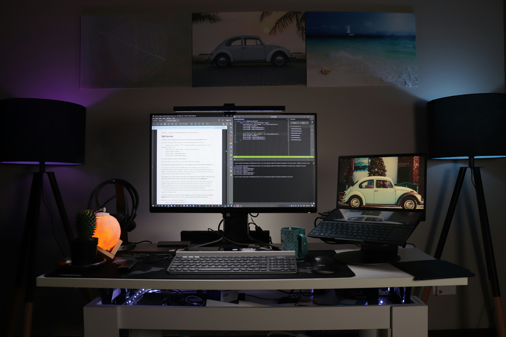

<!DOCTYPE HTML>
<html>
	<head>
		<title>Nour Portfolio</title>
		<meta charset="utf-8" />
		<meta name="viewport" content="width=device-width, initial-scale=1, user-scalable=no" />
	<link rel="stylesheet" href="css/main.css" />
	</head>
	<body class="is-preload">

		<!-- Header -->
			

				

					<!-- Logo -->
						

							
							<h1 id="title">Nour Bennacer</h1>
							
Software Devoloper

						

					<!-- Nav -->
						<nav id="nav">
							<ul>
								<li><a href="#top" id="top-link">Intro</a></li>
								<li><a href="#about" id="about-link">About Me</a></li>
								<li><a href="#portfolio" id="portfolio-link">Portfolio</a></li>
								<li><a href="#contact" id="contact-link">Contact</a></li>
							</ul>
						</nav>

				

        	

		<!-- Main -->
			

				<!-- Intro -->
					<section id="top" class="one dark cover">
                        
						

                            
							<header>
                                
								<h1 class="alt">Welcome to my corner of GitHub! Feel free to roam through my 
									projects and witness the creativity and dedication I pour into software 
									development.</h1>
							
								<h1 class="alt2">Nour Portfolio</h1>
							</header>

						

					</section>

					<!-- About Me -->
					<section id="about" class="three">
						

							<header>
								<h2>About Me</h2>
							</header>

							

							
I am currently a Software Development and Computer Science student, 
							diving deep into the world of programming and problem-solving. My academic
							journey equips me with the skills needed for the fast-paced field 
							of software development.

							 

							<h2>Hobbies:</h2>
							

								<ul>
									<li><h2>Hiking:</h2> 
										I love challenging myself both physically and mentally while immersing in the beauty of nature.</li>
									<li><h2>Traveling:</h2> 
										Beyond just visiting new places, I see it as an enriching experience to absorb different cultures and perspectives.</li>
									<li><h2>Snorkeling:</h2> 
										Exploring the wonders beneath the ocean's surface allows me to connect with the serenity of the underwater world.</li>
									<li><h2>Swimming:</h2> 
										Whether in a pool or the open sea, swimming is not just an activity but a way to embrace the vastness and tranquility of the water.</li>
        						</ul>
							

						

					</section>

				<!-- Portfolio -->
					<section id="portfolio" class="two">
						

							<header>
								<h1>Portfolio</h1>
							</header>

							
 Hey there! I'm excited to share with you the cool projects 
								I've been working on as a software developer student. In 
								this portfolio, you'll see stuff I've made outside of class. 
								Some by following online courses for learning, and some just for fun!
								I got into software development because I love playing 
								around with computers and making things work. I've learned 
								a bunch of stuff in school and on my own, and these projects
								 are my way of showing what I can do.
								Thanks for checking out my portfolio! 
								I'm really proud of what I've done, and I hope you find 
								something you like.

							

								

									<article class="item">
										
										
										<header>
											<h3>Nav Animation from Udemy Courses</h3>
										</header>
									</article>
									<article class="item">
										
										<header>
											<h3>Heart Double Click from Udemy Courses</h3>
										</header>
									</article>
								

								

									<article class="item">
										
										<header>
											<h3>Expanding Cards from Udemy Courses</h3>
										</header>
									</article>
									<article class="item">
										
										<header>
											<h3>Form Wave Animation from Udemy Courses</h3>
										</header>
									</article>
								

								

									<article class="item">
										
										<header>
											<h3>GitHub Search Tool from Udemy Courses</h3>
										</header>
									</article>
									<article class="item">
										
										<header>
											<h3>Fishing Game Personal project</h3>
										</header>
									</article>
                                

                                

                                    <article class="item">
										
										<header>
											<h3>Animal Protection Website Personal Project</h3>
										</header>
                                    </article>
                                    <article class="item">
                                        
                                        <header>
                                            <h3>NY Times Article Search Personal Project</h3>
                                        </header>
                                    </article>
                                

							

						

					</section>

				

				<!-- Contact -->
					<section id="contact" class="four">
						

							<header>
								<h2>Contact:</h2>
							</header>
							
Feel free to contact me via email:

							<a href="mailto:your_email@example.com">nbennacer@student.cscc.edu</a>
						
			
					</section>

			

		<!-- Scripts -->
			
			
			
			
			
			
			
            
	</body>
</html>
